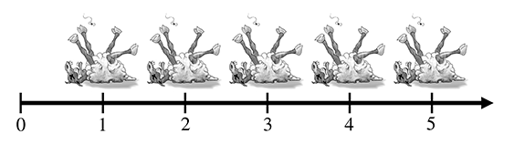
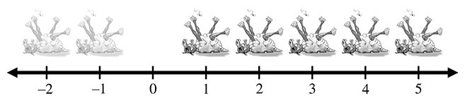

# Глава 1. Декартова Система Координат {#chapter-1}

> Прежде чем обратиться к моральным и интеллектуальным аспектам проблемы, в которых заключаются самые большие трудности,
> исследователю надлежит приобрести более простые навыки.
>
> — Шерлок Холмс из Этюда А Багровых Тонах (1887)

Трехмерная математика — это точное математическое измерение местоположения, расстояний и углов в трехмерном
пространстве. Наиболее часто используемая система для выполнения таких вычислений на компьютере называется Декартовой
Системой Координат. Декартова математика была изобретена блестящим Французским философом, физиком и математиком Рене
Декартом, жившим с 1596 по 1650 годы. Рене Декарт прославился не только тем, что изобрел аналитическую геометрию,
которая в то время представляла собой потрясающее объединение алгебры и геометрии. Он также известен тем, что довольно
убедительно ответил на вопрос «Откуда мне знать, что что-то правда?» — вопрос, над которым с удовольствием размышляли
целые поколения философов, и который не обязательно связан с мертвыми овцами (что, возможно, станет главной темой
следующего раздела, вызывающей трудности) если только ты сам того не хочешь. Декарт отверг ответы, предложенные древними
греками, а именно этос (грубо говоря, «потому что я так сказал»), пафос («потому что это было бы здорово») и логос (
«потому что в этом есть смысл»), и решил разобраться во всем самостоятельно, вооружившись карандашом и бумагой.

Эта глава разделена на несколько основных разделов:

- [Раздел 1.1](#section-1.1) рассматривает основные принципы систем счисления и первый закон компьютерной графики.
- [Раздел 1.2](#section-1.2) вводит двумерную Декартову математику — математику плоских поверхностей. Здесь рассказано
  как определять расположение точек в 2D пространстве.
- [Раздел 1.3](#section-1.3) расширяет идеи до трех измерений. В неё рассказано о лево- и право-руких система х
  координат и устанавливает некоторые условные обозначения, используемые в этой книге.
- [Раздел 1.4](#section-1.4) завершает главу кратким обзором различных предварительных сведений.

# 1.1 1D Математика {#section-1.1}

Вы читаете эту книгу, потому что хотите узнать о трехмерной математике, и вам, наверное, интересно, зачем мы вообще
говорим об одномерной математике. Что ж, прежде чем перейти к трехмерному пространству, нам бы хотелось прояснить пару
моментов, связанных с системами счисления и подсчетом.

_Натуральные числа_, которые часто называют _счётными числами_, были изобретены тысячелетия назад, вероятно, для того,
чтобы вести учёт мёртвых овец. Понятие «одна овца» появилось довольно легко (см. Рисунок 1.1), затем появились «две
овцы», «три овцы», но люди очень быстро поняли, что это слишком трудоёмко, и в какой-то момент перестали считать,
называя это «много овец». В разных культурах люди переставали считать в разное время, в зависимости от того, когда им
начинало становиться скучно. Со временем цивилизация развилась настолько, что мы уже могли позволить себе нанимать
людей, которые будут сидеть и думать о числах, вместо того чтобы заниматься более насущными делами, например убивать
овец и есть их. Эти умы увековечили понятие нуля (отсутствие овец), и хотя они не придумали названия для всех
натуральных чисел, они разработали различные системы, с помощью которых при желании можно было бы их обозначить,
используя такие цифры, как 1, 2 и т. д. (или, если вы римлянин, M, X, I и т. д.). Так появилась математика.

Привычка выстраивать овец в ряд, чтобы их было легко пересчитать, привела к появлению понятия числовой прямой, то есть
линии, на которой через равные промежутки отмечены числа, как на Рисунке 1.2. В принципе, эта линия может быть сколь
угодно длинной, но, чтобы не заскучать, мы остановились на пяти овцах и указали стрелкой, что линия может продолжаться.
Более проницательные мыслители могут представить, что она уходит в бесконечность, но древние охотники на мёртвых овец,
вероятно, не задумывались об этом, разве что в своих мечтах и лихорадочных фантазиях.

В какой-то момент истории люди, вероятно, осознали, что некоторые особо предприимчивые торговцы могут продавать овец,
которых у них на самом деле нет, и таким образом одновременно изобрели такие важные понятия, как долг и отрицательные
числа. Продав эту мнимую овцу, торговец на самом деле получал «минус одну» овцу, что привело к открытию _целых_ чисел,
которые состоят из натуральных чисел и их отрицательных аналогов. Соответствующая числовая прямая для целых чисел
показана на Рисунке 1.3.

Вероятно, понятие бедности появилось раньше понятия долга, что привело к росту числа людей, которые могли позволить себе
купить только половину тушки овцы или, может быть, даже четверть. Это привело к широкому распространению дробных чисел,
состоящих из одного целого числа, деленного на другое, например 2/3 или 111/27. Математики называют такие числа
_рациональными_, и на числовой прямой они располагаются в очевидных местах между целыми числами. В какой-то момент люди
поленились и изобрели десятичную систему счисления, написав, например, «3,1415» вместо более длинного и утомительного
«31415/10000».

Со временем было замечено, что некоторые числа, встречающиеся в повседневной жизни, не могут быть выражены в виде дроби.
Классический пример — отношение длины окружности к её диаметру, обычно обозначаемое как 𝛑 (произносится как «пи"). Это
так называемые _действительные числа_, к которым относятся как рациональные числа, так и такие числа, как 𝛑, для
представления которых в десятичной системе счисления потребовалось бы бесконечное количество знаков после запятой.
Многие считают математику действительных чисел важнейшей областью математики. На самом деле она лежит в основе
большинства инженерных дисциплин, поэтому можно сказать, что именно она создала большую часть современной цивилизации.
Особенность действительных чисел в том, что, хотя рациональные числа можно пересчитать (то есть поставить в
один-единственный ряд с натуральными числами), действительные числа несчётны. Изучение натуральных и целых чисел
называется _дискретной математикой_, а изучение действительных чисел — _непрерывной математикой_. 
