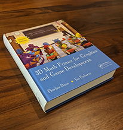

# Введение

> Прежде всего — важное, но не обязательно по порядку
>
> — Доктор Кто из Меглоса (1980)

# Об онлайн издании

То, что вы сейчас читаете изначально было книгой. Сегодня большинство из нас получает знания о 3D-математике и
видеоиграх из интернета, поэтому некоторые читатели могут не представлять, как выглядит физическая копия книги. Если Вы
один из них — посмотрите Изображение 1.

Книги содержат такие архаичные вещи, как регистрационный номер ISBN, библиотечный индекс, библиографию, пронумерованные
главы, разделы и страницы, также сплошные абзацы, не разбитые на фрагменты по 280 символов — как, кстати, абзац, который
Вы сейчас читаете. Это кладь знаний, весом около полутора килограммов, даёт множество преимуществ перед онлайн форматом.
С её помощью можно подпереть стол, или защитить этот стол от горячих капель кофе. Также умные книги можно поставить на
видное место для того, чтобы выразить свою индивидуальность — реальную или желаемую —, и это будет работать независимо
от того, читали вы книгу или нет! Но самое большое преимущество бумажной книги заключается в том, что взяв её в руки
можно сразу понять, сколько времени уйдёт на её прочтение.

К слову, эта книга была опубликована в 2011-м году. В 2011-м свой второй день рождения отпраздновала League of Legends,
в этом году был выпущен Slyrim и до релиза PS4 оставалось ещё 2 года. Но мы с гордостью скажем, что большинство
материатов из этой книги, как и Барт Симпсон, не постореют ни на день и через десятки лет. Веторы и матрицы работают и
по сей день, F также равно ma, и люди всё ещё используют Blinn-Phong.

Однако, некоторые части это книги всё же начали потихоньку устаревать. Это две наименее теоретические и наиболее
практические главы (Главы [10](#chapter-10) и [12](#chapter-12)), которые не помешало бы обновить и сместить акценты. В
этой книге нет ссылок на сайты, моложе 10 лет. Шутки и отсылки к поп-культуре, которые и так были на грани допустимого,
теперь устарели (однако, Я — переводчик — при возможности постараюсь исправить это). Мы будем работать над этим, и Вы
можете помочь, оставив [отзыв](#feedback). 
